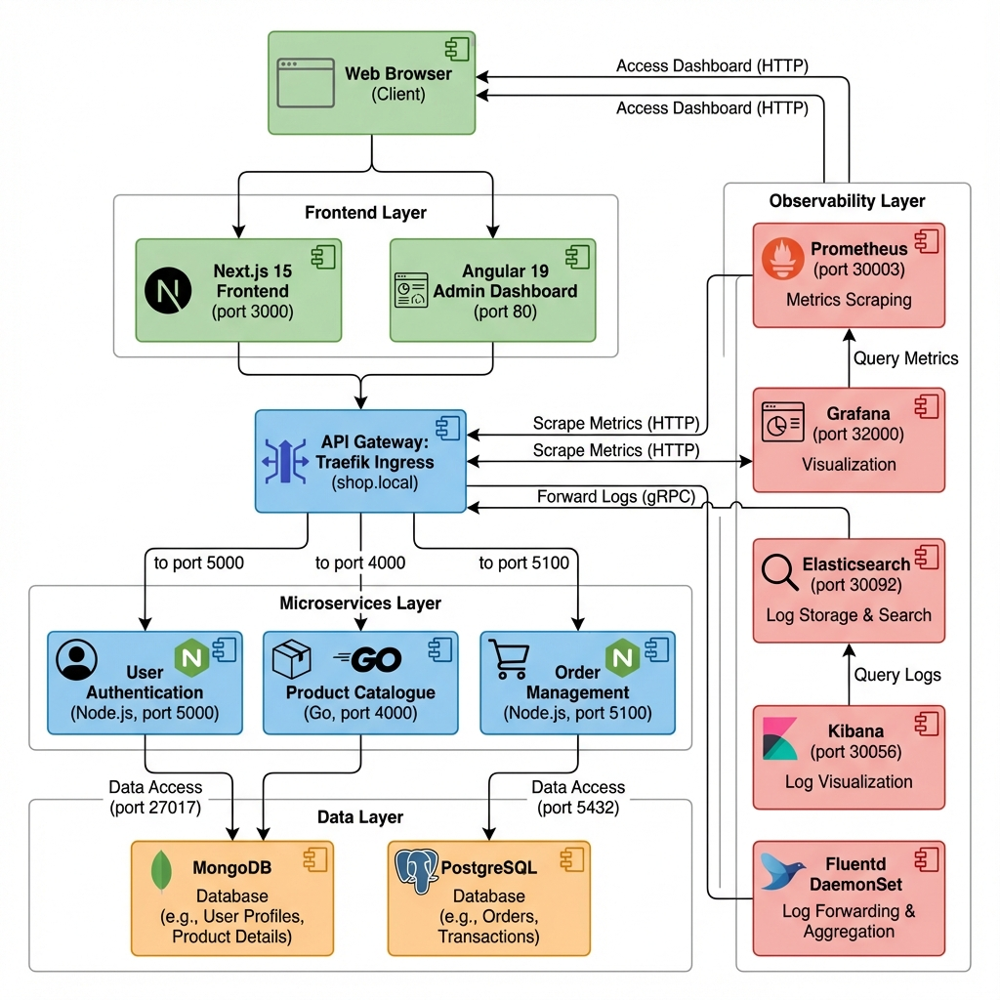
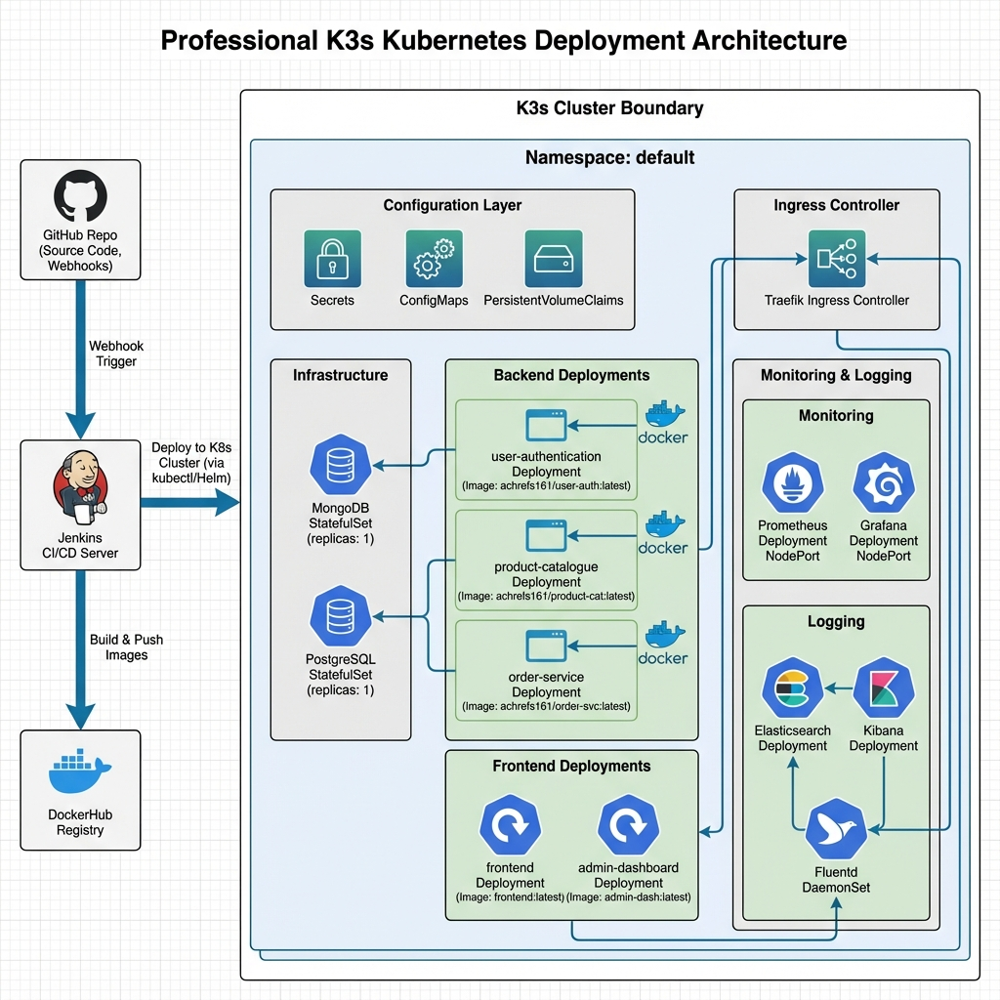
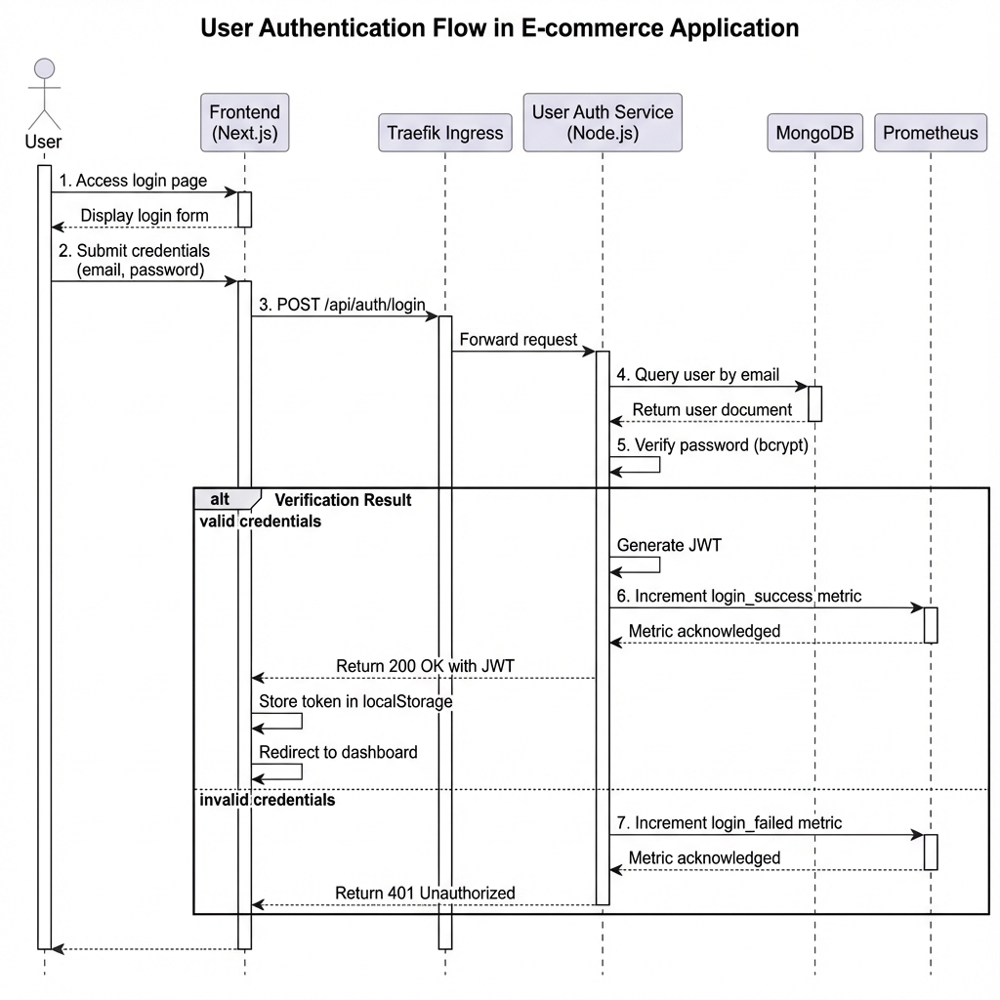
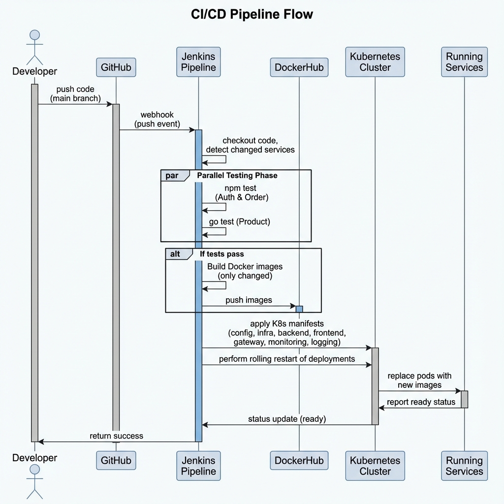
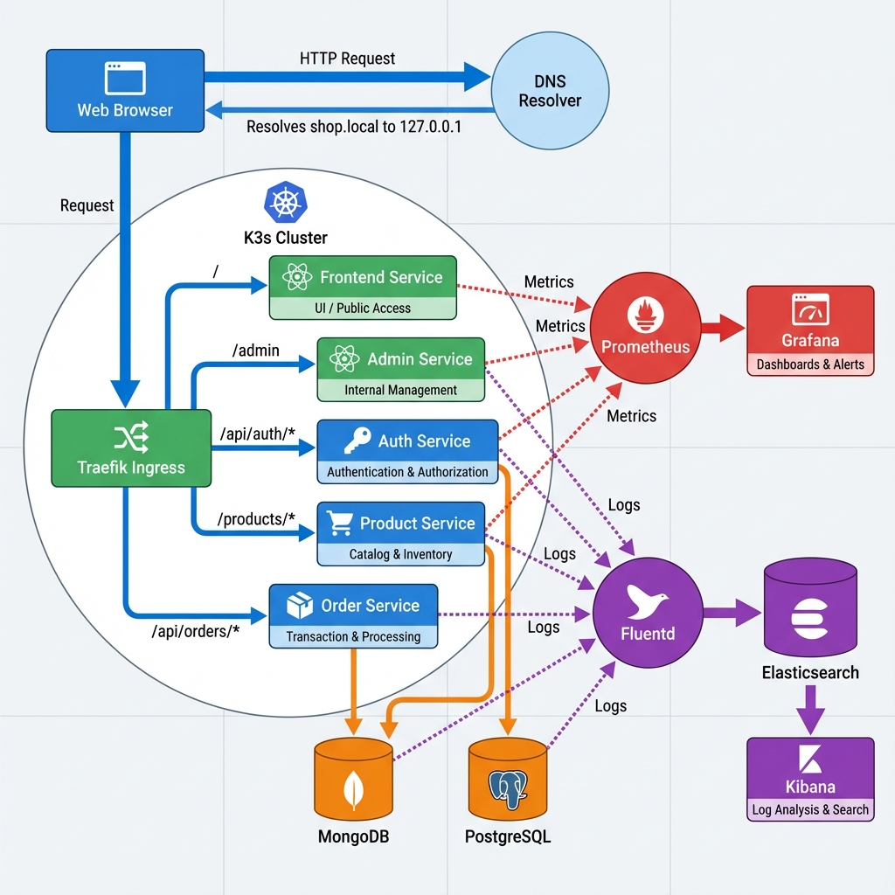
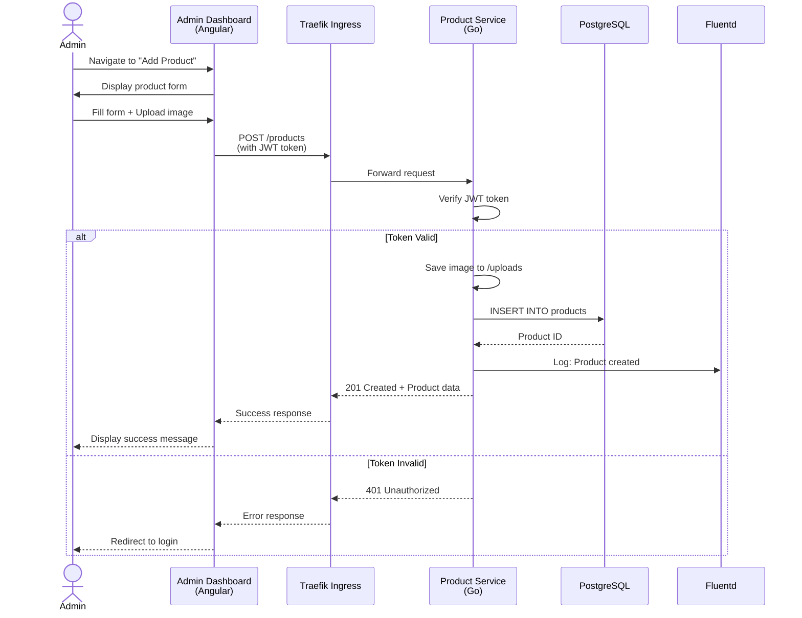
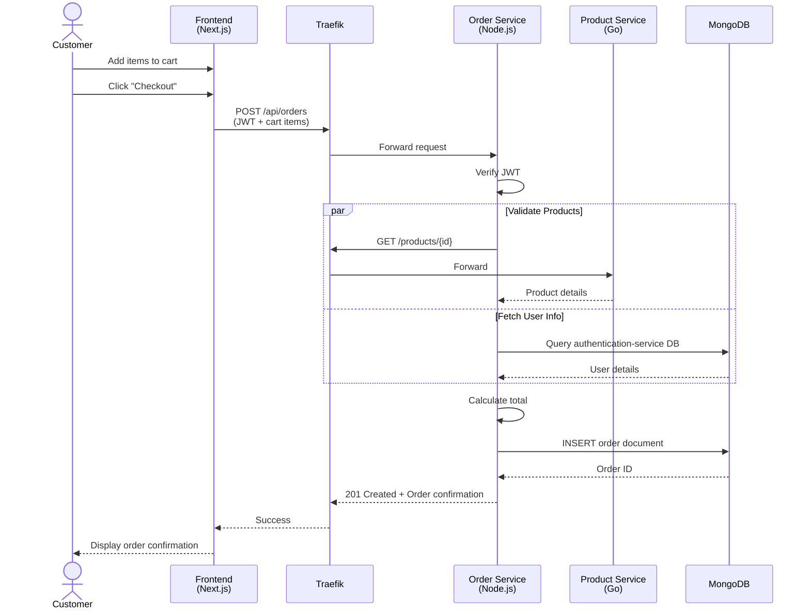
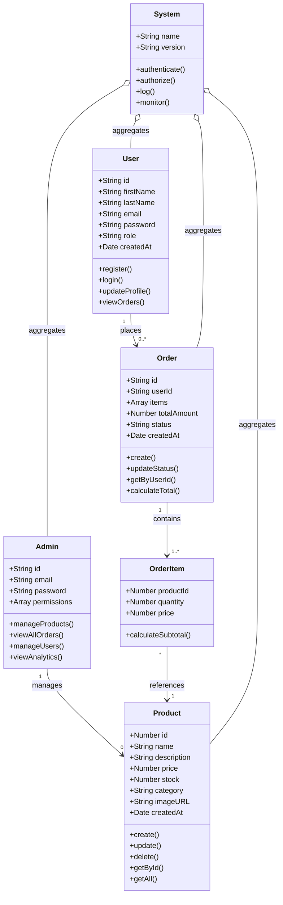

# UML Architecture Diagrams - Visual Gallery

This document contains visual representations of the UML diagrams for the E-Commerce DevOps Project.

---

## 1. Component Diagram (Architecture Overview)

Complete system architecture showing all layers from client to observability.



**Components:**
- **Client Layer**: Web Browser
- **Frontend**: Next.js 15 (port 3000) and Angular 19 Admin Dashboard (port 80)
- **API Gateway**: Traefik Ingress (shop.local)
- **Backend Microservices**: User Auth (Node.js, 5000), Product (Go, 4000), Order (Node.js, 5100)
- **Databases**: MongoDB and PostgreSQL
- **Monitoring**: Prometheus (30003) and Grafana (32000)
- **Logging**: Elasticsearch (30092), Kibana (30056), Fluentd DaemonSet

---

## 2. Kubernetes Deployment Diagram

K3s cluster architecture showing all deployments, services, and external integrations.



**Infrastructure:**
- **Configuration**: Secrets, ConfigMaps, PersistentVolumeClaims
- **StatefulSets**: MongoDB and PostgreSQL (replicas: 1)
- **Deployments**: All microservices and frontend apps
- **Ingress**: Traefik controller
- **Observability**: Prometheus, Grafana, EFK Stack
- **CI/CD**: GitHub → Jenkins → DockerHub → K8s

---

## 3. User Authentication Sequence Diagram

Complete authentication flow from login to JWT token generation.



**Flow:**
1. User submits credentials
2. Frontend sends POST request through Ingress
3. Auth Service validates against MongoDB
4. Password verification with bcrypt
5. JWT token generation (if valid)
6. Metrics recorded in Prometheus
7. Response returned to Frontend

---

## 4. CI/CD Pipeline Sequence Diagram

Complete Jenkins pipeline workflow from code push to deployment.



**Stages:**
1. Developer pushes to GitHub
2. Webhook triggers Jenkins
3. Change detection identifies modified services
4. Parallel testing (npm test, go test)
5. Conditional Docker builds (only changed services)
6. Sequential K8s deployments (configuration → infrastructure → services → observability)
7. Rolling restart of deployments
8. Success notification

---

## 5. Data Flow Diagram

Complete request cycle showing how data flows through the entire system.



**Flow:**
- **HTTP Request**: User → Browser → DNS (shop.local) → K3s Cluster
- **Routing**: Traefik Ingress routes to appropriate service
- **Data Persistence**: Services read/write to MongoDB and PostgreSQL
- **Monitoring**: Metrics flow to Prometheus → Grafana dashboards
- **Logging**: Logs collected by Fluentd → Elasticsearch → Kibana visualization

---

---

## 6. Class Diagram - User Authentication Service

UML class diagram showing the structure of the authentication service.


**Classes:**
- **User**: Model with attributes (_id, firstName, lastName, email, password, createdAt) and methods (save, findByEmail, comparePassword)
- **AuthController**: Handles register, login, and getUserProfile endpoints
- **AuthMiddleware**: JWT token verification and extraction
- **JWT**: Token signing and verification utilities
- **BCrypt**: Password hashing and comparison
- **Prometheus**: Metrics collection (login_total, register_total, request_duration)

---

## 7. Class Diagram - Product Catalogue Service (Go)

```mermaid
classDiagram
    class Product {
        +uint ID
        +string Name
        +string Description
        +float64 Price
        +int Stock
        +string Category
        +string ImageURL
        +time.Time CreatedAt
    }
    
    class ProductController {
        +GetAllProducts(c *fiber.Ctx)
        +GetProductByID(c *fiber.Ctx)
        +CreateProduct(c *fiber.Ctx)
        +UpdateProduct(c *fiber.Ctx)
        +DeleteProduct(c *fiber.Ctx)
        +UploadImage(c *fiber.Ctx)
    }
    
    class Database {
        +*gorm.DB DB
        +Connect(config Config)
        +AutoMigrate(model interface{})
    }
    
    class AuthMiddleware {
        +JWTProtected(c *fiber.Ctx)
        +ValidateToken(token string)
    }
    
    class PrometheusMiddleware {
        +Middleware(c *fiber.Ctx)
        +RegisterMetrics()
    }
    
    ProductController --> Product : manages
    ProductController --> Database : uses
    ProductController --> AuthMiddleware : protected by
    ProductController --> PrometheusMiddleware : monitored by
```

**Structure:**
- **Product**: GORM model with all product attributes
- **ProductController**: Fiber handlers for CRUD operations and image upload
- **Database**: GORM database connection and migration
- **AuthMiddleware**: JWT protection for routes
- **PrometheusMiddleware**: Automatic metrics collection

---

## 8. Sequence Diagram - Product Creation (Admin)



**Flow:**
1. Admin fills product form with name, price, description, stock, category, and image
2. Angular dashboard sends POST request with JWT authentication
3. Product service verifies token and saves image
4. Data persisted in PostgreSQL
5. Success confirmation logged and returned

---

## 9. Sequence Diagram - Order Creation



**Flow:**
1. Customer adds products to cart and proceeds to checkout
2. Frontend sends order request with JWT and cart items
3. Order service validates products via Product service
4. Fetches user information from MongoDB (parallel operations)
5. Calculates total and creates order
6. Returns confirmation to customer

---

## 10. Application Domain Model (Class Diagram)



**Domain Entities:**
- **User**: Customer accounts with authentication and order history
- **Admin**: Administrative accounts with elevated permissions
- **Product**: Product catalog with inventory management
- **Order**: Customer orders with items and total calculation
- **OrderItem**: Individual items within an order
- **System**: Core system managing authentication, authorization, logging, and monitoring

**Relationships:**
- One User can place many Orders (1 → 0..*)
- One Admin manages many Products (1 → 0..*)
- One Order contains one or more OrderItems (1 → 1..*)
- Many OrderItems reference one Product (* → 1)
- System aggregates all entities

---

## 11. Use Case Diagram

```mermaid
graph TB
    subgraph "E-Commerce Platform"
        UC1[Browse Products]
        UC2[Search Products]
        UC3[View Product Details]
        UC4[Add to Cart]
        UC5[Place Order]
        UC6[Register Account]
        UC7[Login]
        UC8[View Order History]
        UC9[Update Profile]
        
        UC10[Manage Products]
        UC11[Upload Product Images]
        UC12[View All Orders]
        UC13[Update Order Status]
        UC14[View Analytics]
        UC15[Manage Users]
        
        UC16[Authenticate User]
        UC17[Process Payment]
        UC18[Send Notifications]
        UC19[Generate Reports]
        
        UC2 -.->|extends| UC1
        UC5 -.->|includes| UC16
        UC5 -.->|includes| UC17
        UC10 -.->|includes| UC16
    end
    
    Customer((Customer))
    Admin((Admin))
    SystemActor((System))
    
    Customer --> UC1
    Customer --> UC2
    Customer --> UC3
    Customer --> UC4
    Customer --> UC5
    Customer --> UC6
    Customer --> UC7
    Customer --> UC8
    Customer --> UC9
    
    Admin --> UC7
    Admin --> UC10
    Admin --> UC11
    Admin --> UC12
    Admin --> UC13
    Admin --> UC14
    Admin --> UC15
    
    SystemActor --> UC16
    SystemActor --> UC17
    SystemActor --> UC18
    SystemActor --> UC19
    
    style UC1 fill:#4CAF50,color:#fff
    style UC5 fill:#4CAF50,color:#fff
    style UC10 fill:#2196F3,color:#fff
    style UC16 fill:#FF9800,color:#fff
    style UC17 fill:#FF9800,color:#fff
```



**Actors:**
- **Customer**: End users who browse and purchase products
- **Admin**: Administrators who manage the platform
- **System**: Backend system handling authentication, payments, and notifications

**Customer Use Cases:**
- Browse Products, Search Products, View Product Details
- Add to Cart, Place Order (includes Authenticate User and Process Payment)
- Register Account, Login
- View Order History, Update Profile

**Admin Use Cases:**
- Manage Products (CRUD operations, includes Authenticate User)
- Upload Product Images
- View All Orders, Update Order Status
- View Analytics/Dashboard
- Manage Users

**System Use Cases:**
- Authenticate User (shared by multiple use cases)
- Process Payment (payment gateway integration)
- Send Notifications (email/SMS)
- Generate Reports (analytics)

**Relationships:**
- **Extends**: Search Products extends Browse Products
- **Includes**: Place Order includes Authenticate User and Process Payment
- **Includes**: Manage Products includes Authenticate User

---

## Usage

These diagrams can be used for:
- **Documentation**: Technical documentation and presentations
- **Onboarding**: New team member orientation
- **Architecture Reviews**: System design discussions
- **Presentations**: Client or stakeholder presentations
- **Education**: Teaching microservices and DevOps concepts

## File Locations

All diagram images are stored in the `/diagrams` directory:
- `component_diagram_*.png`
- `kubernetes_deployment_*.png`
- `authentication_sequence_*.png`
- `cicd_pipeline_*.png`
- `data_flow_*.png`

## Mermaid Source

For the editable Mermaid source code of these diagrams, see [UML_DIAGRAMS.md](./UML_DIAGRAMS.md).
