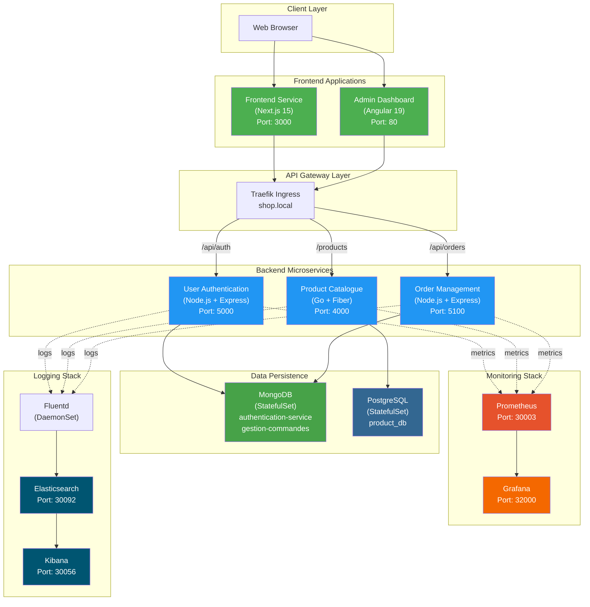
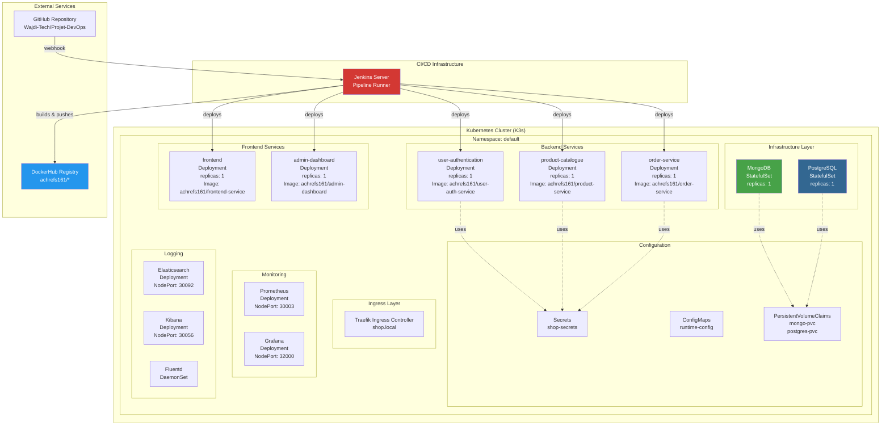
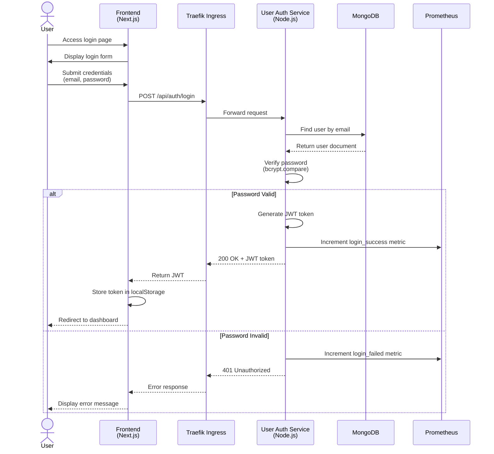
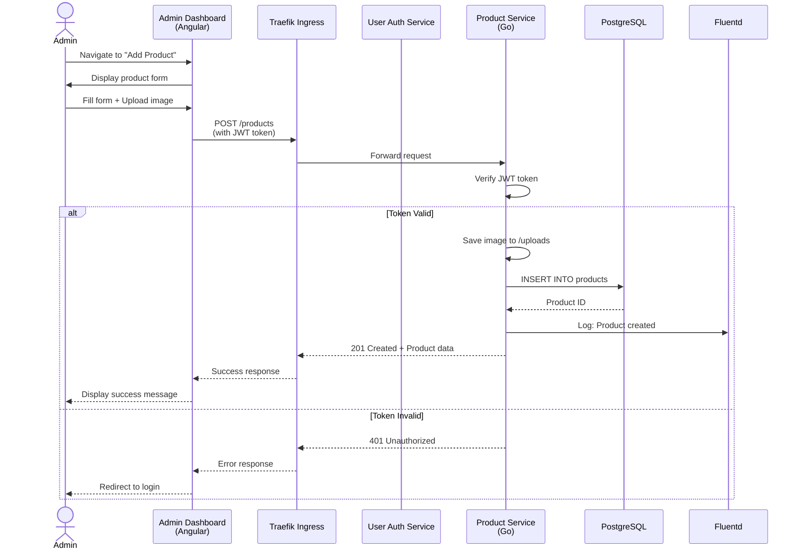
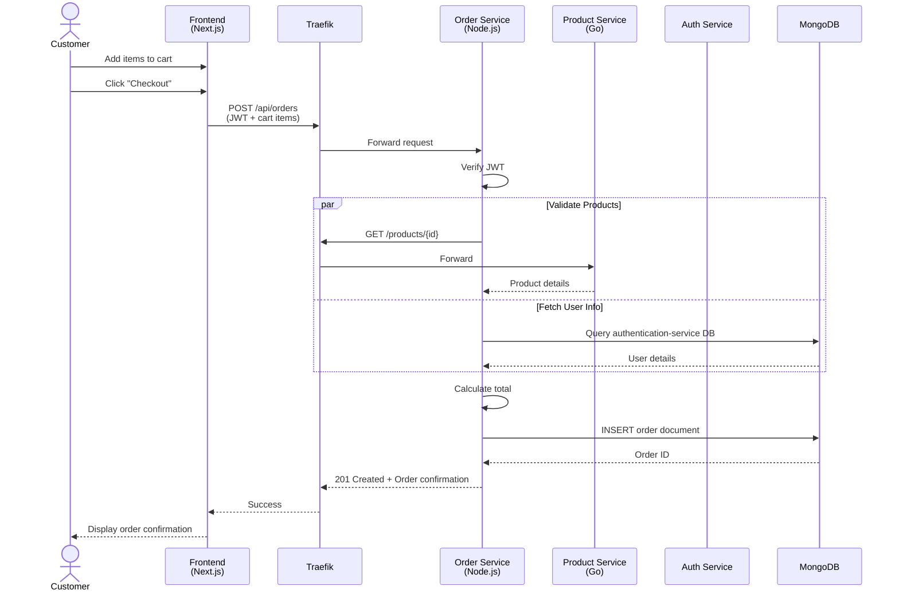
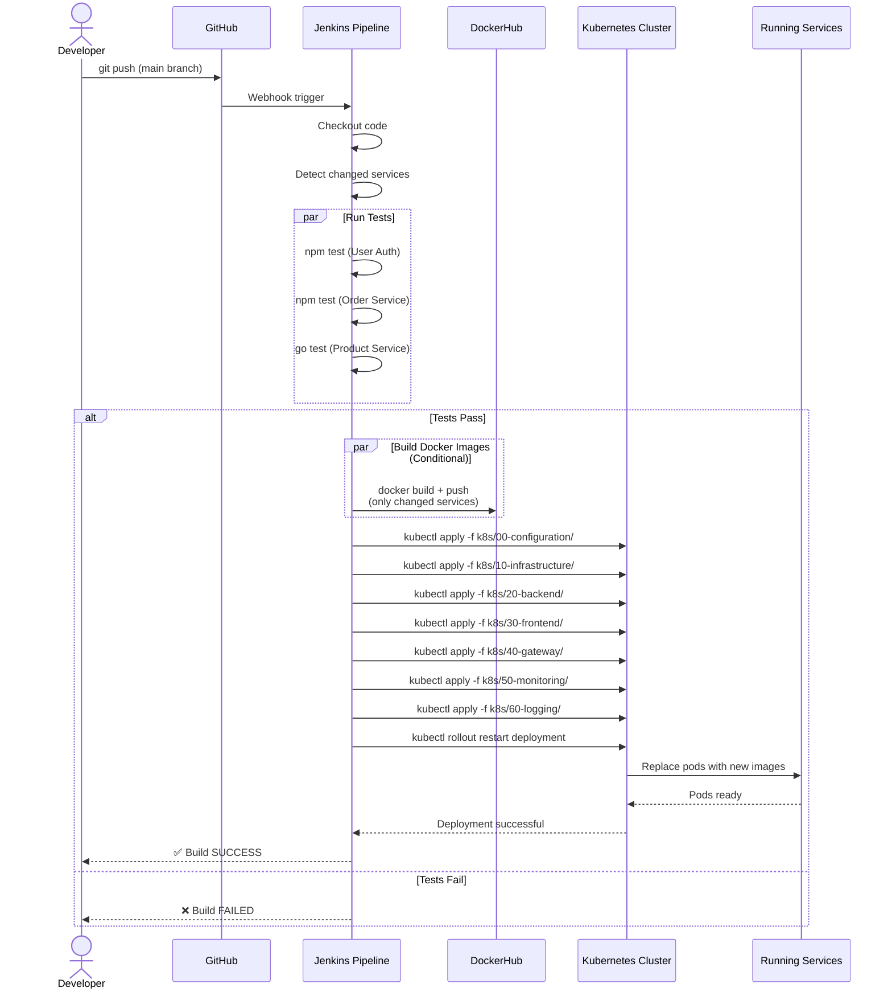
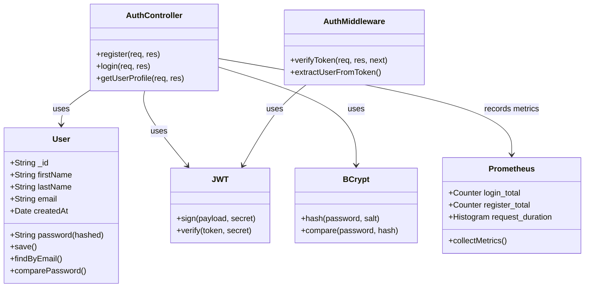
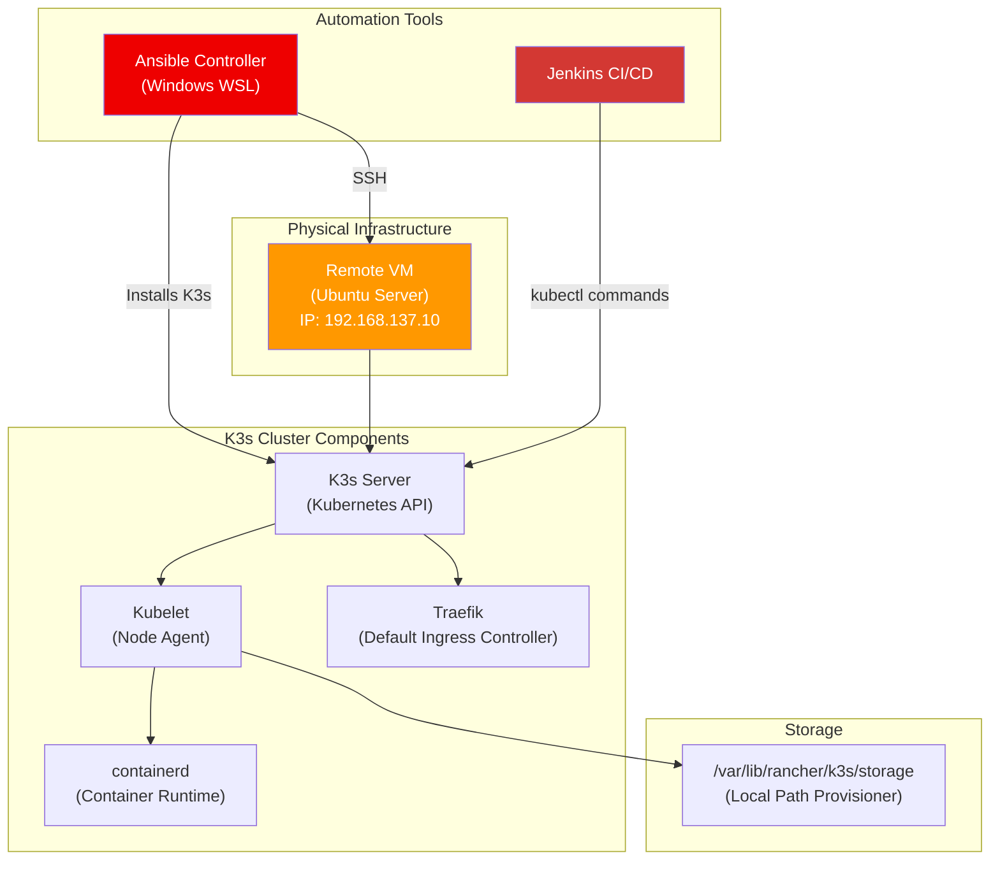
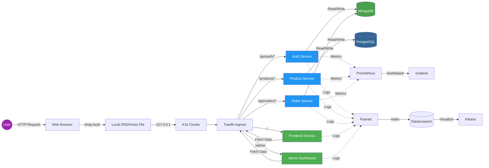

# UML Architecture Diagrams - E-Commerce DevOps Project

## 1. Component Diagram (Vue d'ensemble du système)



---

## 2. Deployment Diagram (Diagramme de déploiement Kubernetes)



---

## 3. Sequence Diagram - User Authentication Flow



---

## 4. Sequence Diagram - Product Creation Flow (Admin)



---

## 5. Sequence Diagram - Order Creation Flow



---

## 6. CI/CD Pipeline Sequence Diagram



---

## 7. Class Diagram - User Authentication Service



---

## 8. Class Diagram - Product Catalogue Service (Go)

```mermaid
classDiagram
    class Product {
        +uint ID
        +string Name
        +string Description
        +float64 Price
        +int Stock
        +string Category
        +string ImageURL
        +time.Time CreatedAt
    }
    
    class ProductController {
        +GetAllProducts(c *fiber.Ctx)
        +GetProductByID(c *fiber.Ctx)
        +CreateProduct(c *fiber.Ctx)
        +UpdateProduct(c *fiber.Ctx)
        +DeleteProduct(c *fiber.Ctx)
        +UploadImage(c *fiber.Ctx)
    }
    
    class Database {
        +*gorm.DB DB
        +Connect(config Config)
        +AutoMigrate(model interface{})
    }
    
    class AuthMiddleware {
        +JWTProtected(c *fiber.Ctx)
        +ValidateToken(token string)
    }
    
    class PrometheusMiddleware {
        +Middleware(c *fiber.Ctx)
        +RegisterMetrics()
    }
    
    ProductController --> Product : manages
    ProductController --> Database : uses
    ProductController --> AuthMiddleware : protected by
    ProductController --> PrometheusMiddleware : monitored by
```

---

## 9. Infrastructure Component Diagram



---

## 10. Data Flow Diagram - Complete Request Cycle



---

## Légende des Diagrammes

### Types de Connexions
- **Ligne pleine (→)**: Flux de données direct / Appel synchrone
- **Ligne pointillée (-.→)**: Flux asynchrone / Monitoring / Logging
- **Ligne épaisse**: Connexion principale
- **Ligne fine**: Connexion secondaire

### Couleurs des Composants
- 🟢 **Vert**: Applications frontend (Next.js, Angular)
- 🔵 **Bleu**: Services backend (Node.js, Go)
- 🟠 **Orange**: Bases de données (MongoDB, PostgreSQL)
- 🔴 **Rouge**: Outils CI/CD (Jenkins, Prometheus, Grafana)
- 🟣 **Violet**: Services de logging (EFK Stack)

### Ports Principaux
- **3000**: Frontend (Next.js)
- **80**: Admin Dashboard (Angular)
- **5000**: User Authentication Service
- **4000**: Product Catalogue Service
- **5100**: Order Management Service
- **27017**: MongoDB
- **5432**: PostgreSQL
- **30003**: Prometheus (NodePort)
- **32000**: Grafana (NodePort)
- **30092**: Elasticsearch (NodePort)
- **30056**: Kibana (NodePort)
