# UML Architecture Diagrams - E-Commerce DevOps Project

## 1. Component Diagram (Vue d'ensemble du système)


---

## 2. Deployment Diagram (Diagramme de déploiement Kubernetes)


---

## 3. Sequence Diagram - User Authentication Flow


---

## 4. Sequence Diagram - Product Creation Flow (Admin)


---

## 5. Sequence Diagram - Order Creation Flow


---

## 6. CI/CD Pipeline Sequence Diagram

```mermaid
sequenceDiagram
    actor Developer
    participant GitHub as GitHub
    participant Jenkins as Jenkins Pipeline
    participant Docker as DockerHub
    participant K8s as Kubernetes Cluster
    participant Services as Running Services
    
    Developer->>GitHub: git push (main branch)
    GitHub->>Jenkins: Webhook trigger
    
    Jenkins->>Jenkins: Checkout code
    Jenkins->>Jenkins: Detect changed services
    
    par Run Tests
        Jenkins->>Jenkins: npm test (User Auth)
        Jenkins->>Jenkins: npm test (Order Service)
        Jenkins->>Jenkins: go test (Product Service)
    end
    
    alt Tests Pass
        par Build Docker Images (Conditional)
            Jenkins->>Docker: docker build + push<br/>(only changed services)
        end
        
        Jenkins->>K8s: kubectl apply -f k8s/00-configuration/
        Jenkins->>K8s: kubectl apply -f k8s/10-infrastructure/
        Jenkins->>K8s: kubectl apply -f k8s/20-backend/
        Jenkins->>K8s: kubectl apply -f k8s/30-frontend/
        Jenkins->>K8s: kubectl apply -f k8s/40-gateway/
        Jenkins->>K8s: kubectl apply -f k8s/50-monitoring/
        Jenkins->>K8s: kubectl apply -f k8s/60-logging/
        
        Jenkins->>K8s: kubectl rollout restart deployment
        K8s->>Services: Replace pods with new images
        Services-->>K8s: Pods ready
        K8s-->>Jenkins: Deployment successful
        Jenkins-->>Developer: ✅ Build SUCCESS
    else Tests Fail
        Jenkins-->>Developer: ❌ Build FAILED
    end
```



---

## 7. Class Diagram - User Authentication Service


---

## 8. Class Diagram - Product Catalogue Service (Go)

```mermaid
classDiagram
    class Product {
        +uint ID
        +string Name
        +string Description
        +float64 Price
        +int Stock
        +string Category
        +string ImageURL
        +time.Time CreatedAt
    }
    
    class ProductController {
        +GetAllProducts(c *fiber.Ctx)
        +GetProductByID(c *fiber.Ctx)
        +CreateProduct(c *fiber.Ctx)
        +UpdateProduct(c *fiber.Ctx)
        +DeleteProduct(c *fiber.Ctx)
        +UploadImage(c *fiber.Ctx)
    }
    
    class Database {
        +*gorm.DB DB
        +Connect(config Config)
        +AutoMigrate(model interface{})
    }
    
    class AuthMiddleware {
        +JWTProtected(c *fiber.Ctx)
        +ValidateToken(token string)
    }
    
    class PrometheusMiddleware {
        +Middleware(c *fiber.Ctx)
        +RegisterMetrics()
    }
    
    ProductController --> Product : manages
    ProductController --> Database : uses
    ProductController --> AuthMiddleware : protected by
    ProductController --> PrometheusMiddleware : monitored by
```

---

## 9. Infrastructure Component Diagram


---

## 10. Data Flow Diagram - Complete Request Cycle


---

## Légende des Diagrammes

### Types de Connexions
- **Ligne pleine (→)**: Flux de données direct / Appel synchrone
- **Ligne pointillée (-.→)**: Flux asynchrone / Monitoring / Logging
- **Ligne épaisse**: Connexion principale
- **Ligne fine**: Connexion secondaire

### Couleurs des Composants
- 🟢 **Vert**: Applications frontend (Next.js, Angular)
- 🔵 **Bleu**: Services backend (Node.js, Go)
- 🟠 **Orange**: Bases de données (MongoDB, PostgreSQL)
- 🔴 **Rouge**: Outils CI/CD (Jenkins, Prometheus, Grafana)
- 🟣 **Violet**: Services de logging (EFK Stack)

### Ports Principaux
- **3000**: Frontend (Next.js)
- **80**: Admin Dashboard (Angular)
- **5000**: User Authentication Service
- **4000**: Product Catalogue Service
- **5100**: Order Management Service
- **27017**: MongoDB
- **5432**: PostgreSQL
- **30003**: Prometheus (NodePort)
- **32000**: Grafana (NodePort)
- **30092**: Elasticsearch (NodePort)
- **30056**: Kibana (NodePort)
